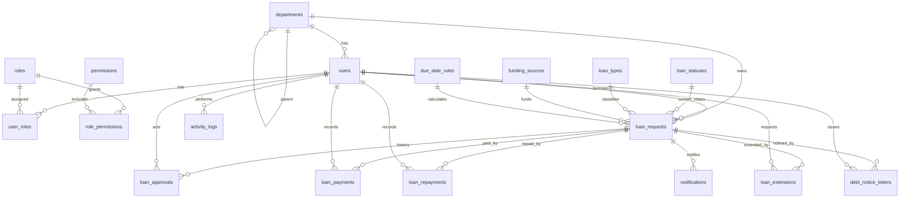

# Phase 3: Database Schema

## Scope

Phase 3 สร้างโครงสร้างฐานข้อมูล MySQL สำหรับระบบบริหารลูกหนี้เงินยืม โดยยึด workflow จาก Phase 1 และโครงสร้างโปรเจกต์จาก Phase 2

ไฟล์ที่เพิ่ม:

- `database/migrations/001_create_schema.sql`
- `database/migrations/002_seed_reference_data.sql`
- `database/seeds/001_demo_users.sql`

## Design Principles

- ใช้ MySQL 8.x, `utf8mb4`, `utf8mb4_unicode_ci`
- ใช้ lookup tables สำหรับ role, permission, loan status, loan type, funding source และ due date rule
- เก็บสถานะล่าสุดของรายการไว้ที่ `loan_requests.status_code`
- เก็บประวัติการเปลี่ยนสถานะไว้ที่ `loan_approvals`
- แยกธุรกรรมการจ่ายเงินและส่งใช้เงินยืมออกจากรายการขอยืม
- ใช้ soft delete ในตารางสำคัญผ่าน `deleted_at`
- ใช้ `activity_logs` สำหรับ audit trail ระดับระบบ
- ใช้ `notifications` สำหรับแจ้งเตือนรายการรอดำเนินการหรือครบกำหนด

## Entity Overview



## Core Tables

### Access Control

- `roles` - บทบาทหลัก เช่น borrower, finance_officer, admin
- `permissions` - สิทธิ์ระดับ feature
- `role_permissions` - mapping บทบาทกับสิทธิ์
- `users` - ผู้ใช้งานระบบ
- `user_roles` - ผู้ใช้หนึ่งคนมีได้หลายบทบาท

### Organization

- `departments` - หน่วยงานแบบลำดับชั้น รองรับวิทยาเขต คณะ งาน และแผนก

### Loan Master Data

- `loan_statuses` - สถานะตาม lifecycle จาก Phase 1
- `loan_types` - ยืมจากส่วนงานหรือยืมจากมหาวิทยาลัย
- `funding_sources` - เงินทุนหมุนเวียน เงินทดรองจ่าย หรืออื่นๆ
- `due_date_rules` - เงื่อนไขวันครบกำหนด

### Loan Transactions

- `loan_requests` - รายการขอยืมเงินและสถานะปัจจุบัน
- `loan_approvals` - ประวัติการตรวจสอบ อนุมัติ ตีกลับ และเปลี่ยนสถานะ
- `loan_payments` - ข้อมูลการจ่ายเงิน
- `loan_repayments` - ข้อมูลการส่งใช้เงินยืม
- `loan_extensions` - คำขอขยายอายุสัญญา
- `debt_notice_letters` - หนังสือทวงเงินยืม

### Supporting Tables

- `attachments` - ไฟล์แนบแบบ polymorphic owner
- `notifications` - แจ้งเตือนผู้ใช้
- `activity_logs` - audit log
- `system_settings` - ตั้งค่าระบบ เช่น ข้อมูลวิทยาเขตและรูปแบบเลขเอกสาร
- `password_reset_tokens`, `refresh_tokens` - รองรับ authentication ใน Phase 4

## Status Seed

`002_seed_reference_data.sql` เพิ่มสถานะหลัก:

- `draft`
- `pending_department_review`
- `pending_university_finance_review`
- `pending_department_approval`
- `budget_reviewed`
- `finance_reviewed`
- `approved`
- `paid`
- `partially_repaid`
- `fully_repaid`
- `overdue`
- `extension_requested`
- `extension_approved`
- `extension_rejected`
- `rejected`
- `cancelled`

## Important Relationships

- `loan_requests.borrower_id` -> `users.id`
- `loan_requests.department_id` -> `departments.id`
- `loan_requests.status_code` -> `loan_statuses.code`
- `loan_requests.loan_type_id` -> `loan_types.id`
- `loan_requests.funding_source_id` -> `funding_sources.id`
- `loan_approvals.loan_request_id` -> `loan_requests.id`
- `loan_payments.loan_request_id` -> `loan_requests.id`
- `loan_repayments.loan_request_id` -> `loan_requests.id`
- `loan_extensions.loan_request_id` -> `loan_requests.id`
- `debt_notice_letters.loan_request_id` -> `loan_requests.id`

## Business Constraints

- ยอดเงินยืมต้องมากกว่า 0
- ยอดคงเหลือใน `loan_requests.current_balance` ต้องไม่ติดลบ
- ยอดจ่ายเงินและยอดส่งใช้ต้องมากกว่า 0
- วันครบกำหนดใหม่ใน `loan_extensions.requested_due_date` ต้องมากกว่าวันครบกำหนดเดิม
- `request_no` ต้องไม่ซ้ำ
- `contract_no` ต้องไม่ซ้ำเมื่อมีเลขสัญญาแล้ว
- `notice_no` ต้องไม่ซ้ำ

## Running Locally

เริ่ม MySQL:

```bash
docker compose up -d mysql
```

เมื่อ container ถูกสร้างครั้งแรก ระบบจะรันไฟล์ใน `database/migrations/` อัตโนมัติ

ถ้าต้องการรัน demo users:

```bash
mysql -h localhost -P 3307 -u loan_user -p rmuti_surin_loan < database/seeds/001_demo_users.sql
```

## Phase 3 Acceptance Criteria

- มี migration สำหรับสร้างตารางหลักครบตาม Phase 1
- มี foreign keys และ indexes สำหรับ workflow สำคัญ
- มี reference data สำหรับ roles, permissions, statuses, loan types, funding sources และ due date rules
- มี seed demo users แยกจาก migration หลัก
- มีเอกสารอธิบาย schema และ relationship สำหรับ Phase 4
